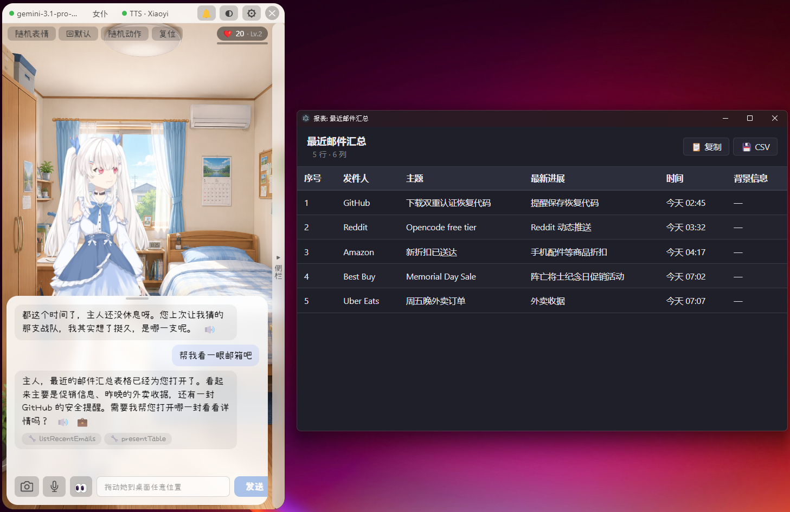

# OpenMeido

> 桌面 AI 陪伴 · Desktop AI companion



---

## 中文

桌面上一个透明置顶的 Live2D 形象，会和你聊天、记住你说过的事、读你的邮箱、定提醒、在你长时间不动的时候主动来一句关心。

**v0.0.36 开始**：会和你**经营关系**——好感度上去了她说话方式都会变（从生疏礼貌到敢顶嘴、敢撒娇），不只是换个称呼。

### 下载

到 [Releases](https://github.com/lshhhhhhh/OpenMeido/releases) 拿最新的 `OpenMeido-Setup-X.X.X.exe`，双击安装。没签名，Windows SmartScreen 弹一次「更多信息 → 仍要运行」过掉。

### 首次启动

会弹引导窗，挑一个 AI 接口注册 + 粘 key。**默认推荐智谱 GLM**——免费多模态、国内可访问、一键注册。

| Backend | 特点 |
|---|---|
| **智谱 GLM** | 免费多模态、国内 ★ 推荐 |
| Gemini | Google · 有免费额度 |
| DeepSeek | V4 价格屠夫（不支持图） |
| 通义千问 Qwen | 阿里 · 新用户送 token |
| 豆包 Doubao | 字节 · 国内手机号 |
| OpenAI | 付费 |
| LM Studio | 本地跑、无需 key |

### 核心特色

- **🎮 游戏化好感度** — 跟她聊得越久，她对你越熟。**生疏期**（Lv.1）只回 1-2 句礼貌应答；**熟络后**（Lv.3）会反问 / 关心你的状态；**默契期**（Lv.5）敢顶嘴、敢分享自己的看法、敢有不同意见。聊天时右上角 chip 显示当前好感度 + 进度条到下一档，每次判定后会浮 +1 / -1 数字像 MMO 伤害数字
- **🔔 一键闭嘴 / 一键召回** — 聊天面板顶部一个按钮，工作中按一下让她闭嘴 + 红色提示，再按一下她回来打招呼。每个人设有专属的进 / 出口台词随机抽（"主人忙完啦？想我没？"）
- **多个人设** — 内置女仆、妹妹、傲娇大小姐三个原型，每个有自己的称呼 + 性格 + 专属台词。也可以**自定义**：填写性格、口头禅、称呼
- **4 种 TTS** — Microsoft Edge TTS（默认，免费）/ GPT-SoVITS（本地、零样本声音克隆）/ **MiniMax 海螺**（云端，国内 + 国际双端点，多种音色）/ **火山引擎 豆包**（云端大模型语音）
- **3 种内置字体** — 小赖（最日系手书）/ LXGW 文楷 / 得意黑（开源字体打包入安装包），Settings 里可视化对比 + 切换
- **截屏给她看** — 一键截屏发给 LLM，让她评论 / 解释 / 翻译屏幕内容
- **邮件 + 表格** — 连了 IMAP 邮箱后，"总结最近 10 封"她会读完用表格窗口呈现，可以让她"加一列时间 / 隐藏广告 / 帮我起草回信"。多 tab 表格可对比
- **会记得你说过的话** — 跨会话续连。她记得你的名字、工作、兴趣，自然带进后续对话
- **预制台词可编辑** — `%APPDATA%/openmeido/lines.json`，记事本改她的反应风格
- **透明窗口 + 点穿** — 形象边缘点击穿透到桌面，形象本体 + 聊天框正常响应

### 自带模型

启动后默认是 **Hiyori**（蓝头发萝莉）。设置里可切换 **Haru**（粉头发大姐姐）。这两个是 Live2D 官方免费样本。

### 自己导入 Live2D 模型

去 [Live2D 官方 sample 页](https://www.live2d.com/zh-CHS/learn/sample/)（或网上找别的）下载 zip，**设置 → Live2D → 导入 zip**。情绪绑表情可以手动编辑，或者点 **✨ AI 绑定**让大模型自动猜。

### 配置 / 数据存哪儿

所有用户数据放在 `%APPDATA%/openmeido/`。设置界面里全都能改，手编 JSON 主要用于跨机器同步或版本控制。

| 文件 | 内容 |
|---|---|
| `config.json` | Backend / 人设 / 邮箱 / 语音 / 主动模式等 |
| `lines.json` | 闭嘴按钮反馈台词（每人设 × 好感度档分类）|
| `memory.sqlite` | 对话记忆 + 好感度 + 提炼出的事实 |
| `live2d-models/<name>/openmeido.json` | 每个 Live2D 模型的情绪绑定 |
| `demos.json` | Demo 模式的热键 + 台词 |

### 自带模型版权说明

- **Hiyori Pro / Haru Greeter Pro** —— Live2D Inc. 出品，授权基于 [Live2D Free Material License Agreement](https://www.live2d.com/eula/live2d-free-material-license-agreement_zh-CN.html)。商业使用前请阅读条款
- **Live2D Cubism Core** —— [Cubism SDK Release License](https://www.live2d.com/eula/live2d-proprietary-software-license-agreement_zh.html)
- **Cubism Components**（JS runtime）—— MIT
- **小赖字体 / LXGW 文楷 / 得意黑** —— SIL OFL 1.1（开源商用免费）

### 致谢

- **INVC. 老潘** —— 早期产品想法 + 功能需求反馈

---

## English

A transparent always-on-top Live2D character that sits on your desktop. She chats with you, remembers what you tell her, reads your email, sets reminders, and quietly speaks up when you've gone idle for too long.

**Starting v0.0.36**: She has a **relationship meter** — as you chat more, she gets less formal and more candid. At low affinity she answers in polite 1-2 sentence replies; at high affinity she pushes back, shares her own views, and reminisces. It's not just an address-term swap.

### Install

Grab the latest `OpenMeido-Setup-X.X.X.exe` from [Releases](https://github.com/lshhhhhhh/OpenMeido/releases) and double-click. Build is unsigned — Windows SmartScreen will warn once; click "More info → Run anyway".

### First run

A setup window asks you to pick an AI backend, register, and paste an API key. **Default recommendation is Zhipu GLM** — free multimodal tier, China-accessible, one-click registration.

| Backend | Notes |
|---|---|
| **Zhipu GLM** | Free multimodal · China-accessible ★ recommended |
| Gemini | Google · free quota |
| DeepSeek | V4 cheapest (text-only) |
| Qwen | Alibaba · new-user token bonus |
| Doubao | ByteDance · mainland-China phone required |
| OpenAI | Paid |
| LM Studio | Local · no key needed |

### Highlights

- **🎮 Gamified affinity** — chat with her enough and she opens up. **Stranger tier** (Lv.1) gets polite 1-2 sentence answers; **friendly** (Lv.3) she'll ask back and check on you; **close** (Lv.5) she pushes back, shares opinions, holds her ground. A chip in the top-right shows the score + progress bar to next tier; every judgement floats a `+1` / `-1` over the chip MMO-damage-number style
- **🔔 One-click mute / unmute** — top-right button in the chat panel. Click to silence her (turns red); click again and she greets you back with a randomly picked persona-aware line ("主人忙完啦？想我没？")
- **Multiple personas** — three built-in archetypes (maid / younger sister / tsundere lady), each with their own address terms, personality traits, and feedback lines. Or write your own custom persona
- **4 TTS engines** — Microsoft Edge TTS (default, free) / GPT-SoVITS (local zero-shot voice cloning) / **MiniMax Hailuo** (cloud, CN + international endpoints, many voices) / **Volcengine Doubao** (cloud, ByteDance LLM-based voices)
- **3 bundled fonts** — Xiaolai (Japanese 濑户 style handwriting) / LXGW WenKai / Smiley Sans (all open source SIL OFL, ship with the installer). Settings shows live previews to pick
- **Screen capture** — one-click send your current screen to the LLM for commentary / explanation / translation
- **Email + tables** — wire up an IMAP mailbox and she'll "summarize the latest 10" by reading them and rendering a sortable table window. Then say "add a date column / hide ads / draft a reply" and watch her iterate. Multi-tab tables for side-by-side comparison
- **Memory across sessions** — she remembers your name, job, interests, naturally bringing them up later
- **Editable preset台词** — `%APPDATA%/openmeido/lines.json`. Open in Notepad to tune her in-character reactions
- **Transparent window + click-through** — empty pixels around the character pass clicks to your desktop; body + chat panel intercept normally

### Bundled models

Default is **Hiyori** (blue-hair loli). Settings lets you switch to **Haru** (pink-hair onee-san). Both are Live2D official free samples.

### Adding your own Live2D model

Download a sample zip from the [Live2D sample page](https://www.live2d.com/en/learn/sample/), then **Settings → Live2D → Import zip**, pick the file. The model unpacks into your user directory and shows up in the dropdown. Edit the emotion mapping manually or hit ✨ AI auto-bind.

### Where things live

All user data lives under `%APPDATA%/openmeido/`. The Settings GUI covers everything; hand-edit JSON only when you want to share / version-control your config.

| File | What |
|---|---|
| `config.json` | Backend / persona / mail / voice / proactive mode etc. |
| `lines.json` | Mute-button feedback lines (per persona × tier) |
| `memory.sqlite` | Chat memory + affinity + distilled facts |
| `live2d-models/<name>/openmeido.json` | Per-model emotion mapping |
| `demos.json` | Demo hotkeys + lines |

### Bundled-content licensing

- **Hiyori Pro / Haru Greeter Pro** — © Live2D Inc., [Live2D Free Material License Agreement](https://www.live2d.com/eula/live2d-free-material-license-agreement_en.html). Read terms before commercial use
- **Live2D Cubism Core** — [Cubism SDK Release License](https://www.live2d.com/eula/live2d-proprietary-software-license-agreement_en.html)
- **Cubism Components** (the JS runtime) — MIT
- **Xiaolai / LXGW WenKai / Smiley Sans fonts** — SIL OFL 1.1 (open source, commercial use OK)

### Acknowledgements

- **INVC. 老潘 (Lao Pan)** — early product direction + feature requirements feedback

### Build from source

```sh
npm install
npm run dev       # dev mode with HMR
npm run dist      # Windows installer to dist/
```

Full build guide in [BUILD.md](./BUILD.md).

### License

App code: [GPL-3.0](./LICENSE). 3rd-party licensing covered above.
